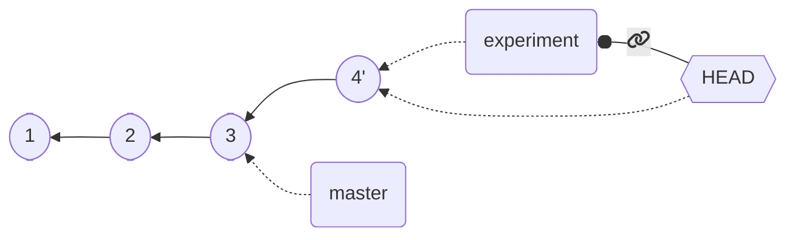
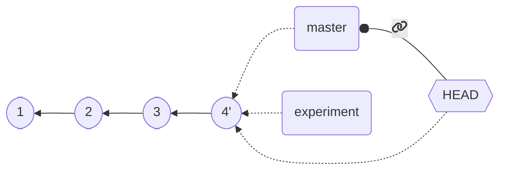
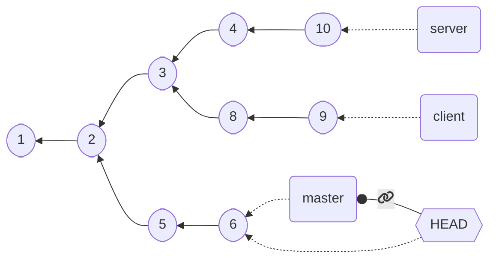
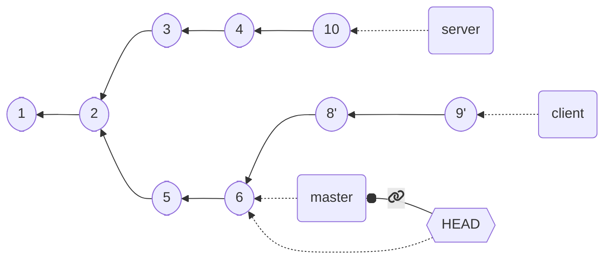

# Pull Request [🔗](https://docs.github.com/en/pull-requests/collaborating-with-pull-requests/proposing-changes-to-your-work-with-pull-requests/creating-a-pull-request)
## When and Why?
- **When:** propose and collaborate on changes (proposed in new branch) to a repository. 
  new_changes_branch 
- **Why:**  ensures that the **default branch (usually `main`) only contains finished** and approved work.

# Git - Advanced

Notes from [Slide SPE - Pianini 🔗](https://unibo-spe.github.io/08-advanced-git/#)

🔗 emoji is a link to a specific slide, you can click on it

## THE GOLDEN RULE OF HISTORY REWRITING
<p style="color: #f25f60; font-size: 15pt; font-weight: bold; font-style: italic">"Don’t push your work until you’re happy with it"</p>

**Locally** --> rewrite history how you want without problem

**Shared/Pushed** --> consider pushed work as final, really hard to change

## Signing Commits (Firmare/Certficiare i commit)

**WHY sign a commit ?**
- certify your authorship
- be a nice person
- on github signed commit have ✅ emoji

**How to configure signature:** usefull link ---> [GPG 🔗](https://central.sonatype.org/publish/requirements/gpg/)
- create own key-pair running on terminal 
  `gpg --gen-key`
  
  `gpg --list-keys`
- distribute it to a key server so that users can validate it using command: 

  `gpg --keyserver <KEY-SERVER> --send-keys <YOUR-PUBLIC-KEY>`

  Use on of the following GPG keyserver:
  - `keyserver.ubuntu.com`
  - `keys.openpgp.org`
  - `pgp.mit.edu`
- configure git to use generate key for signing (firmare) files 
  
  `git config --global user.signingkey <YOUR_KEY_ID>`

## Stashing [🔗](https://unibo-spe.github.io/08-advanced-git/#/3)

Stashing takes the dirty state of the working directory and saves it on a **stack** of *unfinished changes* that you can *reapply at any time*

### Main commands
- `git stash`
  Pushes all dangling changes (staged or unstaged) to the stash
- `git stash list`
  Shows all the accumulated stashes (each item has an index `N` that you can use with following commands)
- `git stash apply` 
  restore last pushed edit and keep it on stack 
- `git stash apply stash@{N}` (eg. `git stash apply stash@2`)
  restore `N`-th pushed edit and left it on stack
- `git stash apply --index` the changes that were staged at the time of push get re-staged
- `git stash drop stash@{N}`
  Deletes the N-th stashed change
- `git stash pop`
  - Re-applies the most recent stash, removing it from the stash
  - Same as `git stash apply && git stash drop stash@{0}`

## Rebase [🔗](https://unibo-spe.github.io/08-advanced-git/#/7)

**Rebasing** provides a way to alter the project history by *changing the parent* of (re-base) existing commits

In other words (in italiano 🇮🇹🍕🍝): un blocco di commit consecutivi di una linea di sviluppo (tutti quelli di un branch o da un punto in avanti) vengono presi ed agganciati all'ultimo commit di un altro branch.
Cambi il commit iniziale di quella sequenza di commit che prendi.

### Practical example with commands
#### Before rebase (fast-forward)

- move to branch i wanna rebase:
  
  `git checkout experiment`
- rebase current branch commits to destination branch (in tha case `master`):

    `git rebase master`
- go back to destination branch and do a merge:
  
  `git checkout master && git merge`

#### After rebase (fast-forward)

### Advanced rebase


We want to leave `server` as is, but rebase `client` onto `master`

Option `--onto` can be used to transplant entire branches
* `git rebase --onto destination start end`
    * pick commits from `start` to `end`
    * reply them starting from `destination`

With command `git rebase --onto master server client` we are saying:
- *pick all commits from `server` (excluded) to `client` (included)
- remove them and reply them starting from `master`*



### Reabse interactive [🔗](https://unibo-spe.github.io/08-advanced-git/#/24)

## Squashing [🔗](https://unibo-spe.github.io/08-advanced-git/#/16)

**In a few words:** collapse some commits into a single one (usefull if you make some experiment and commit changes and afteer you just wanna keep less commits but all changes)

- Allows to **forget “experimental”** commits
- Allows to **merge temporary changes into a single one**
- **Simplifies history**
- Alters history
- Can be performed via merge or manually

#### Command

`git reset --soft <COMMIT>` where `COMMIT` is reference of last commit you wanna collapse (squash) starting from HEAD.
In other word you squash from HEAD to *some commit*.

    0️⃣ <-- 1️⃣ <-- 2️⃣ <-- 3️⃣ (HEAD)

after squashing with ```git reset --soft HEAD~3 && git commit``` bacame:

    0️⃣ <-- 1️⃣ (HEAD)

where inside commit 1️⃣ there are also changes of previous commits 2️⃣ and 3️⃣.

#### Squashing using branches

1. create new branch (eg. commits-to-squash `git branch commits-to-squash-branch`)
2. go back to the last commit you wanna keep in history of final branch (eg. master) `git reset --hard HEAD~4`
3. merge the branches squashing/collapsing commits into one in final branch --> `git merge --squash commits-to-squash-branch && git commit`
4. delete temporany branch `commits-to-squash-branch`

## Squash, merge, or rebase?
Squashing results in *further alteration* than rebase

- **Merge** when you **want to retain history**, keeping **track of what happened**
- **Rebase** only when **you are the only one with the commits**, to favor linearity
- **Squash** when some of the *commits are* somewhat *“tests”*, points in time you **do not want to get back** to anyway